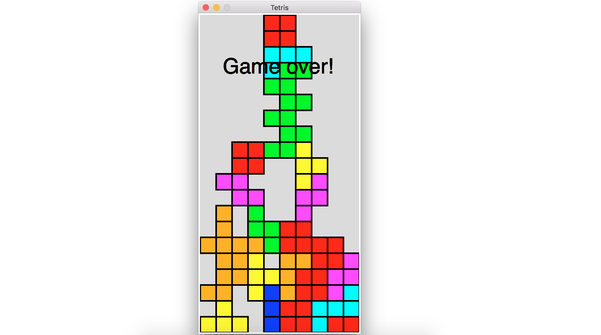

## Tetris

#### Implementation of Tetris in Python

To play, clone the repo and run 'python tetrismain.py' in your terminal.

This implementation of tetris is based off of MIT's OCW course, A Gentle Introduction to Programming Using Python (http://ocw.mit.edu/courses/electrical-engineering-and-computer-science/6-189-a-gentle-introduction-to-programming-using-python-january-iap-2011/assignments/).

